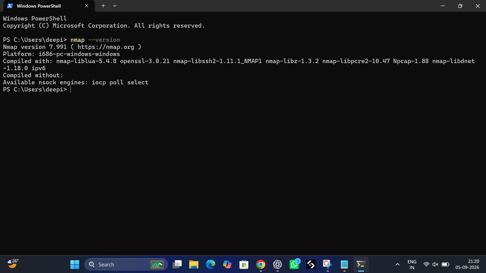
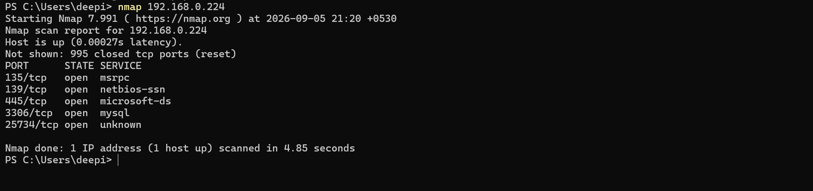
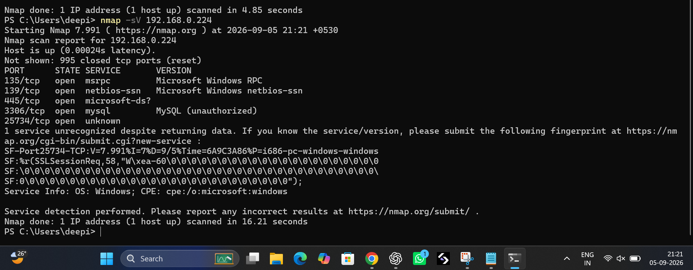
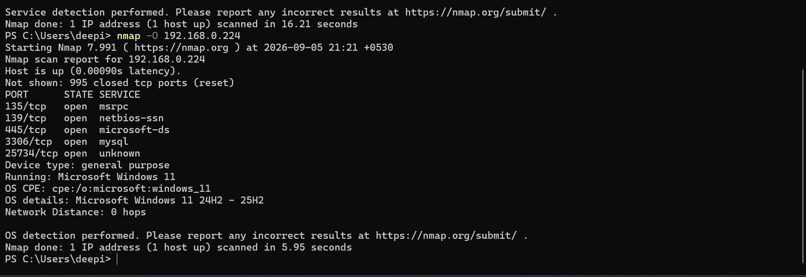
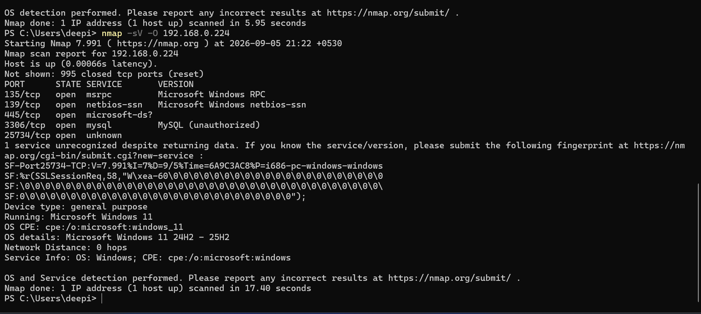

# Task 1 – Basic Network Scanning with Nmap

## Objective

The objective of this task is to perform a basic network scan using Nmap on my own Windows computer, identify open ports and running services, detect the operating system, and analyze possible security risks.

## Target

The scan was performed only on my own authorized local machine.

- **Target IP:** `192.168.0.224`
- **Operating System:** Windows 11
- **Tool Used:** Nmap 7.991
- **Environment:** Local machine

## Nmap Installation

Nmap was installed on the Windows system and verified using the following command:

```powershell
nmap --version
```

The installed version was:

**Nmap version 7.991**

The system also uses **Npcap 1.88**.

## Basic Network Scan

The basic Nmap scan was performed using:

```powershell
nmap 192.168.0.224
```

The scan identified the following open TCP ports:

- **135/tcp** – msrpc
- **139/tcp** – netbios-ssn
- **445/tcp** – microsoft-ds
- **3306/tcp** – mysql
- **25734/tcp** – unknown

The scan also showed **995 closed TCP ports**.

## Service and Version Detection

Service and version detection was performed using:

```powershell
nmap -sV 192.168.0.224
```

This scan provided additional information about the services running on the open ports.

Important findings included:

| Port | Service | Description |
|------|---------|-------------|
| 135/tcp | msrpc | Microsoft Windows RPC |
| 139/tcp | netbios-ssn | Microsoft Windows NetBIOS |
| 445/tcp | microsoft-ds | Windows file and printer sharing |
| 3306/tcp | mysql | MySQL database service |
| 25734/tcp | unknown | Service not identified |

## Operating System Detection

Operating system detection was performed using:

```powershell
nmap -O 192.168.0.224
```

Nmap identified the target operating system as:

**Microsoft Windows 11**

The scan indicated Windows 11 details in the **24H2–25H2** range.

## Combined Scan

A combined service/version and operating system detection scan was performed using:

```powershell
nmap -sV -O 192.168.0.224 -oN nmap_scan_results.txt
```

The results were saved in:

`nmap_scan_results.txt`

This file is included in this repository as evidence of the scan.

## Open Ports and Security Analysis

### Port 135 – Microsoft RPC

Port 135 is used by Microsoft Remote Procedure Call (RPC).

**Security Risk:**
If exposed to an untrusted network, RPC services may increase the attack surface of a Windows system.

**Recommendation:**
Restrict access using Windows Firewall and allow RPC only where required.

### Port 139 – NetBIOS

Port 139 is associated with NetBIOS session services and older Windows networking functionality.

**Security Risk:**
NetBIOS can expose information about Windows systems and network resources when accessible to unauthorized users.

**Recommendation:**
Disable NetBIOS over TCP/IP if it is not required and restrict access through the firewall.

### Port 445 – Microsoft-DS / SMB

Port 445 is commonly used for Windows SMB file and printer sharing.

**Security Risk:**
SMB can become a significant security risk when exposed to untrusted networks, especially if systems are outdated or incorrectly configured.

**Recommendation:**
Keep Windows updated and restrict SMB access to trusted networks.

### Port 3306 – MySQL

Port 3306 is commonly used by MySQL database servers.

**Security Risk:**
A database service exposed unnecessarily may allow unauthorized connection attempts or increase the attack surface.

**Recommendation:**
Allow MySQL connections only from trusted systems and use firewall rules to restrict access.

### Port 25734 – Unknown Service

Nmap identified port 25734 as open, but the service could not be determined.

**Security Risk:**
An unknown open port should be investigated because unnecessary services can increase the attack surface.

**Recommendation:**
Identify which application is using the port and disable the service if it is not required.

## Overall Risk Assessment

The scan identified several open ports related mainly to Windows networking and a MySQL database service.

Open ports are not automatically vulnerabilities. However, unnecessary or improperly protected services can increase the attack surface of a system.

The most important security considerations from this scan are:

1. Restrict Windows RPC and SMB services to trusted networks.
2. Keep Windows and installed applications updated.
3. Secure the MySQL service and avoid unnecessary network exposure.
4. Investigate the unknown service running on port 25734.
5. Use Windows Firewall to control unnecessary inbound connections.
6. Disable services that are not required.

## Screenshots

The following screenshots document the Nmap scanning process:

### 1. Nmap Version



### 2. Basic Nmap Scan



### 3. Service and Version Detection



### 4. Operating System Detection



### 5. Combined Scan



## Ethical Considerations

Network scanning should only be performed on systems that are owned by the user or where explicit authorization has been provided.

For this task, the Nmap scans were performed only on my own local Windows machine.

No external, public, or unauthorized systems were scanned.

## Conclusion

Nmap is a useful network security tool for discovering open ports, identifying services, detecting operating systems, and understanding the attack surface of a system.

Through this task, I performed basic network scanning, service and version detection, and operating system detection on my own Windows computer.

The scan identified several open ports and services that should be properly secured or restricted when they are not required.

This exercise provided practical experience in basic network reconnaissance and security assessment using Nmap.
